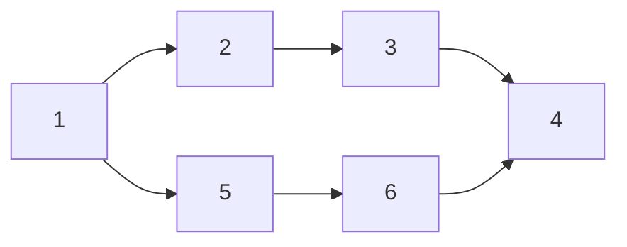

# [HW3.P3] Dynamic Spectrum Artistry Tutorial 
<!-- 文字敘述如何實作 -->
Keywords: strongly connected component, topological sort, DAG

## sample code
<!-- 註解函數、幾個重要變數在幹嘛 -->
```c
#include <stdio.h>
#include <stdbool.h>
#include <stdlib.h>
#include <string.h>

#define MAX_VERTICES 100001

typedef struct LinkListNode{
    int value;
    struct LinkListNode *next;
}LLN;

typedef struct GraphNode{
    int color;
    LLN *head;
    LLN *tail;
}GN;

GN Graph[MAX_VERTICES];         // index = vertex number
GN ReverseGraph[MAX_VERTICES];  // index = vertex number
GN SCCGraph[MAX_VERTICES];      // index = color
bool visited[MAX_VERTICES] = {0};
LLN *stack = NULL;
LLN *new_stack = NULL;
int current_color = 0;

void InitGraph(){
    for(int i = 1; i <= MAX_VERTICES; i++){
        Graph[i].color = -1;
        Graph[i].head = NULL;
        Graph[i].tail = NULL;
        ReverseGraph[i].color = -1;
        ReverseGraph[i].head = NULL;
        ReverseGraph[i].tail = NULL;
        SCCGraph[i].color = i;
        SCCGraph[i].head = NULL;
        SCCGraph[i].tail = NULL;
    }
    return;
}

LLN *InitNode(int value, LLN *next){
    LLN *tmp_node = (LLN *)malloc(sizeof(LLN));
    tmp_node->value = value;
    tmp_node->next = next;
    return tmp_node;
}

void AddEdge(int start, int end, GN *graph){
    // Add edge in Graph
    LLN *tmp_node = InitNode(end, NULL);
    if(graph[start].head == NULL){
        graph[start].head = tmp_node;
        graph[start].tail = tmp_node;
    }
    else{
        graph[start].tail->next = tmp_node;
        graph[start].tail = tmp_node;
    }
    return;
}

LLN *PushStack(int n, LLN *stack){
    LLN *tmp_node = InitNode(n, NULL);
    if(stack == NULL) stack = tmp_node;
    else{
        tmp_node->next = stack;
        stack = tmp_node;
    }
    return stack;
}

void DFS1(int n, GN *graph){
    visited[n] = 1;
    LLN *curr = graph[n].head;
    while(curr != NULL){
        if(visited[curr->value] == 0) DFS1(curr->value, graph);
        curr = curr->next;
    }
    stack = PushStack(n, stack);
    return;
}

void DFS2(int n){
    visited[n] = 1;
    Graph[n].color = current_color;
    LLN * curr = ReverseGraph[n].head;
    while(curr != NULL){
        if(visited[curr->value] == 0) DFS2(curr->value);
        curr = curr->next;
    }
    return;
}

int main(){
    int V, E, mode;
    scanf("%d%d%d", &V, &E, &mode);
    // Intialize Graph and ReverseGraph
    InitGraph();
    // Read edge and add into graph and reverse graph
    int start, end;
    for(int i = 0; i < E; i++){
        scanf("%d%d", &start, &end);
        AddEdge(start, end, Graph);
        AddEdge(end, start, ReverseGraph);
    }
    // First Traversal (forward)
    for(int i = 1; i <= V; i++){
        if(visited[i] == 0) DFS1(i, Graph);
    }
    memset(visited, 0, sizeof(visited));
    // Second Traversal (backward)
    LLN *curr = stack;
    while(curr != NULL){
        int n = curr->value;
        if(visited[n] == 0){
            DFS2(n);
            current_color += 1;
        }
        curr = curr->next;
    }

    // Reconstruct SCC Graph
    for(int i = 1; i <= V; i++){
        curr = Graph[i].head;
        while(curr != NULL){
            if(Graph[i].color != Graph[curr->value].color) AddEdge(Graph[i].color, Graph[curr->value].color, SCCGraph);
            curr = curr->next;
        }
    }
    // Run DFS for DAG and topological sort it
    memset(visited, 0, sizeof(visited));
    stack = NULL;
    for(int i = 0; i < current_color; i++){
        if(!visited[i]) DFS1(i, SCCGraph);
    }
    // Assume the result of topological sort is A, B, C, we need to check whether A->B and B->C.
    bool success = 1;
    LLN *front = stack, *back = front->next;
    while(back != NULL){
        bool founded = 0;
        curr = SCCGraph[front->value].head;
        while(curr != NULL){
            if(curr->value == back->value){
                founded = 1;
                break;
            }
            curr = curr->next;
        }
        if(!founded){
            success = 0;
            break;
        }
        front = back;
        back = back->next;
    }
    if(mode == 1) printf("%d\n", current_color);
    if(mode == 2) printf("%d\n%d\n", current_color, success);
    return 0;
}
```

## common mistakes
<!-- 寫幾個常見錯誤 -->

1. When condensing a graph, a time complexity of $O(V^2)$ will cause a time limit exceeded (TLE) error.
1. Some students claim that "if a graph has exactly one node with an in-degree of zero and one node with an out-degree of zero, a path must exist." However, this is incorrect. Here is a counterexample: 



In this case, there is only one node (1) with an in-degree of 0, and only one node (4) with an out-degree of 0. However, there is no path that passes through all the nodes. 

## coding tips

<!-- 一些簡化程式複雜程度的技巧 -->

1. Graph condensation is unnecessary since during a topological sort on a DAG, each color is visited only once.

