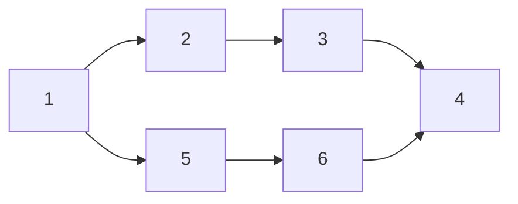

# [HW3.P3] Dynamic Spectrum Artistry Tutorial 
Keywords: `strongly connected component`, `topological sort`, `DAG`

## Sample Code
```c
#include <stdio.h>
#include <stdbool.h>
#include <stdlib.h>
#include <string.h>

#define MAX_VERTICES 100001

typedef struct linkedlistnode {
    int value;
    struct linkedlistnode *next;
} LinkedListNode;

typedef struct graphnode {
    int color;             // record the color of the node
    LinkedListNode *head;  // use linked list to record the neighbor of node
    LinkedListNode *tail;
} GraphNode;

GraphNode Graph[MAX_VERTICES];         // original graph, index = vertex number
GraphNode ReverseGraph[MAX_VERTICES];  // reverse the edges of the original graph, index = vertex number
GraphNode SCCGraph[MAX_VERTICES];      // merge the node with same color as a big node, index = color
bool visited[MAX_VERTICES] = {0};      // record the nodes that is visited by DFS
LinkedListNode *dfs_order = NULL;      // record the DFS order of graph
int current_color = 0;                 // record the current number of color

// Initialize the empty graph
void InitGraph() {
    for(int i = 1; i <= MAX_VERTICES; i++) {
        Graph[i].color = -1;
        Graph[i].head = NULL;
        Graph[i].tail = NULL;
        ReverseGraph[i].color = -1;
        ReverseGraph[i].head = NULL;
        ReverseGraph[i].tail = NULL;
        SCCGraph[i].color = i;
        SCCGraph[i].head = NULL;
        SCCGraph[i].tail = NULL;
    }
    return;
}

// Create a linkedlist node with (`value`, `next`)
LinkedListNode *CreateNode(int value, LinkedListNode *next) {
    LinkedListNode *tmp_node = (LinkedListNode *) malloc(sizeof(LinkedListNode));
    tmp_node -> value = value;
    tmp_node -> next = next;
    return tmp_node;
}

// Add a edge from `start` to `end` on the graph
void AddEdge(int start, int end, GraphNode *graph) {
    LinkedListNode *tmp_node = CreateNode(end, NULL);
    if(graph[start].head == NULL) {
        graph[start].head = tmp_node;
        graph[start].tail = tmp_node;
    }
    else{
        graph[start].tail -> next = tmp_node;
        graph[start].tail = tmp_node;
    }
    return;
}

// Push back a element `n` to the stack
LinkedListNode *PushStack(int n, LinkedListNode *stack) {
    LinkedListNode *tmp_node = CreateNode(n, NULL);
    if(stack == NULL) stack = tmp_node;
    else{
        tmp_node -> next = stack;
        stack = tmp_node;
    }
    return stack;
}

// Do DFS and find the order in which the nodes are visited
void DFS1(int n, GraphNode *graph) {
    visited[n] = 1;
    LinkedListNode *curr = graph[n].head;
    while(curr != NULL) {
        if(visited[curr -> value] == 0) DFS1(curr -> value, graph);
        curr = curr -> next;
    }
    dfs_order = PushStack(n, dfs_order);
    return;
}

// Do DFS on ReverseGraph and find the nodes that are in the same SCC with `n`
void DFS2(int n) {
    visited[n] = 1;
    Graph[n].color = current_color;
    LinkedListNode * curr = ReverseGraph[n].head;
    while(curr != NULL) {
        if(visited[curr -> value] == 0) DFS2(curr -> value);
        curr = curr -> next;
    }
    return;
}

int main() {
    int V, E, mode;
    scanf("%d%d%d", &V, &E, &mode);

    // Intialize Graph and ReverseGraph
    InitGraph();

    // Read edge and add into graph and reverse graph
    int start, end;
    for(int i = 0; i < E; i++) {
        scanf("%d%d", &start, &end);
        AddEdge(start, end, Graph);
        AddEdge(end, start, ReverseGraph);
    }

    // First Traversal (forward)
    for(int i = 1; i <= V; i++) {
        if(visited[i] == 0) DFS1(i, Graph);
    }

    // Second Traversal (backward)
    memset(visited, 0, sizeof(visited));
    LinkedListNode *curr = dfs_order;
    while(curr != NULL) {
        int n = curr -> value;
        if(visited[n] == 0) {
            DFS2(n);
            current_color += 1;
        }
        curr = curr -> next;
    }

    // Reconstruct SCC Graph
    for(int i = 1; i <= V; i++) {
        curr = Graph[i].head;
        while(curr != NULL) {
            if(Graph[i].color != Graph[curr -> value].color) {
                AddEdge(Graph[i].color, Graph[curr -> value].color, SCCGraph);
            }
            curr = curr -> next;
        }
    }

    // Run DFS for DAG and topological sort it
    memset(visited, 0, sizeof(visited));
    dfs_order = NULL;
    for(int i = 0; i < current_color; i++) {
        if(!visited[i]) DFS1(i, SCCGraph);
    }

    // Assume the result of topological sort is A_1, A_2, ... , A_k
    // we need to check whether there exists edges A_1 -> A_2, A_2 -> A_3, ... , A_{k-1} -> A_k
    bool success = 1;
    LinkedListNode *front = dfs_order, *back = front -> next;
    while(back != NULL) {
        bool founded = 0;
        curr = SCCGraph[front -> value].head;
        while(curr != NULL) {
            if(curr -> value == back -> value) {
                founded = 1;
                break;
            }
            curr = curr -> next;
        }
        if(!founded) {
            success = 0;
            break;
        }
        front = back;
        back = back -> next;
    }
    if(mode == 1) printf("%d\n", current_color);
    if(mode == 2) printf("%d\n%d\n", current_color, success);
    return 0;
}
```

## Common Mistakes

1. When condensing a graph, a time complexity of $O(V^2)$ will cause a time limit exceeded (TLE) error.
1. Some students claim that "if a graph has exactly one node with an in-degree of zero and one node with an out-degree of zero, a path must exist." However, this is incorrect. Here is a counterexample: 



In this case, there is only one node (1) with an in-degree of 0, and only one node (4) with an out-degree of 0. However, there is no path that passes through all the nodes. 

## Coding Tips

1. Graph condensation is unnecessary since during a topological sort on a DAG, each color is visited only once.

